# CameraCoach 📸

<div align="center">


</div>

**CameraCoach** is a Flutter mobile app that helps you recreate a reference pose in front of the camera — without needing a professional photographer. Upload any reference photo, let the AI extract a silhouette guide, then align yourself with it in real time. When your pose matches the reference above 97%, the app automatically counts down and captures the shot.

Pose matching runs fully on-device using Google ML Kit. The optional Python backend converts your reference photo into a clean, transparent silhouette overlay.

---

## 👨‍💻 The Story Behind CameraCoach

> *"The idea came from a family trip — a perfect location, a perfect moment, and nobody who knew how to frame the shot the way I had it in my head."*

During a family trip to a scenic location, I asked my parents to take a photo. The setting was ideal, but no matter how I tried to explain the framing and pose I wanted, something was always off. The photo was fine — but it wasn't *the* photo. That frustration stuck with me, and I started thinking: this isn't just my problem. Anyone who's ever tried to direct a non-photographer knows the struggle.

That was the spark for CameraCoach.

I teamed up with a friend to build it. We split the work along our strengths — he focused on the UI and frontend, while I handled the backend logic, computer vision, and ML pipeline. We kicked off development in late February, right in the middle of our college mid-semester exam season. Still, we carved out time every evening and managed to get a rough working prototype within about six weeks.

Our first version used a stick-figure skeleton overlay drawn over the camera feed. It worked, technically, but it looked dated and got in the way of the actual frame. Around this time, we noticed high-end smartphones starting to ship AI camera modes that showed a full-body silhouette guide — a soft, glowing outline of the subject. That was the look we wanted.

So we pivoted.

Building a backend pipeline that could reliably extract a clean silhouette from *any* user-provided photo — different lighting, backgrounds, clothing, body types — took nearly two months of iteration. Getting the GrabCut segmentation, TFLite pose landmarks, and neon glow rendering to all cooperate was the hardest part of the project. We also built an auto-capture workflow into the live session: once the app detects a 97%+ pose match held for five consecutive frames, it starts a 3-second cancelable countdown and fires the shutter automatically. No fumbling with the shutter button right when you've finally nailed the pose.

---

## 🗺️ App Flow

```mermaid
flowchart LR
    %% ── Launch ──────────────────────────────────────────────────────────────
    START([🚀 Launch]) --> FIRST{First\nlaunch?}
    FIRST -->|Yes| OB[🎉 Onboarding\n3-page walkthrough]
    FIRST -->|No| HOME
    OB --> HOME[🏠 Home Screen]

    %% ── Phase 1 · Reference Setup ───────────────────────────────────────────
    HOME -->|Upload reference| PICK[📂 Pick Photo\nfrom Gallery]

    PICK --> API[🌐 Backend API\ngenerate_overlay]
    API -->|Success| PREV[🖼️ Preview\nSilhouette]
    API -->|Offline / failed| FALLBACK[📱 On-Device\nSilhouetteGenerator]
    FALLBACK --> PREV

    PREV --> EDIT{Happy with\noverlay?}
    EDIT -->|Draw corrections| MASK[✏️ Mask Editor\nbrush · erase · undo]
    MASK -->|Save| UPLOAD[☁️ Upload correction\nfire-and-forget]
    UPLOAD --> SAVE
    EDIT -->|Accept| SAVE[(💾 Save Reference\nto secure storage)]
    SAVE --> HOME

    %% ── Phase 2 · Live Coaching ─────────────────────────────────────────────
    HOME -->|Start coaching| CAM[📷 Live Camera\n+ Neon Overlay]
    CAM --> DETECT[🧠 ML Kit Pose\nevery 4th frame]
    DETECT --> SCORE{Match\n≥ 97%?}
    SCORE -->|No| HINT[💬 Guidance hint\non screen]
    HINT --> DETECT
    SCORE -->|Yes × 5 frames| COUNT[⏳ 3-second\ncancelable countdown]
    COUNT -->|User cancels| DETECT
    COUNT -->|Auto-fires| SHOT[📸 Photo captured]

    %% ── Phase 3 · Review ────────────────────────────────────────────────────
    SHOT --> REVIEW[🔍 Capture Review]
    REVIEW --> METRICS[📊 Exposure · Depth\nDynamic Range · Color Temp]
    METRICS --> DONE([🏠 Back to Home])
    DONE --> HOME

    %% ── Styles ──────────────────────────────────────────────────────────────
    classDef phase fill:#1a1a2e,stroke:#7c3aed,color:#e2e8f0
    classDef action fill:#0f172a,stroke:#3b82f6,color:#e2e8f0
    classDef decision fill:#1e293b,stroke:#f59e0b,color:#fbbf24
    classDef storage fill:#0f2027,stroke:#10b981,color:#6ee7b7
    classDef endpoint fill:#1a1a2e,stroke:#6366f1,color:#a5b4fc
    classDef fallback fill:#1c1917,stroke:#ef4444,color:#fca5a5

    class START,DONE endpoint
    class HOME,CAM,PICK,PREV,DETECT,SHOT,REVIEW,METRICS,MASK,COUNT,HINT,UPLOAD,OB action
    class FIRST,EDIT,SCORE decision
    class SAVE storage
    class API phase
    class FALLBACK fallback
```



---

## 💡 Key Features

- **Reference Photo Selection** — Import any target pose from your gallery
- **Smart Silhouette Generation** — Backend converts the reference into a transparent neon glow overlay
- **On-Device Pose Detection** — Real-time analysis using Google ML Kit (no data leaves your phone)
- **Live Match Scoring** — Continuous visual feedback on how closely your pose matches the reference
- **Auto-Capture** — Automatic 3-second countdown fires the shutter once a 97%+ match is held
- **Photo Quality Analysis** — Evaluates exposure, depth of field, dynamic range, and color balance after each shot
- **PRO Camera Controls** — Manually adjust ISO, shutter speed, white balance, and exposure compensation

---

## 🛠️ Tech Stack

| Layer | Technology |
|-------|------------|
| **Frontend** | Flutter & Dart |
| **On-Device CV** | Google ML Kit Pose Detection |
| **Backend CV** | OpenCV · NumPy · SciPy · TensorFlow Lite |
| **Backend API** | FastAPI (Python) |
| **Local Storage** | `flutter_secure_storage` · `shared_preferences` |

---

## 📂 Project Structure

```text
camera_coach/
├── android/                  # Android runner and native camera plugin
├── assets/
│   ├── images/               # App image assets
│   └── models/               # TensorFlow Lite model assets
├── backend/
│   ├── models/               # Backend TFLite model
│   ├── outline.py            # Silhouette extraction and neon overlay generation
│   ├── requirements.txt      # Python dependencies
│   └── server.py             # FastAPI upload endpoint
├── ios/                      # iOS runner and native camera plugin
├── lib/
│   ├── core/                 # App theme and constants
│   ├── features/
│   │   ├── home/             # Home screen — reference upload & coaching entry
│   │   ├── onboarding/       # First-launch walkthrough
│   │   ├── live_session/     # Live camera + pose matching + auto-capture
│   │   └── review/           # Post-capture quality analysis
│   ├── models/               # Reference data model
│   ├── services/             # Camera, pose, storage, API, and analysis services
│   ├── utils/                # Logging
│   └── widgets/              # Reusable UI components
└── test/                     # Flutter unit and widget tests
```

---

## ⚡ Getting Started

### 1️⃣ Prerequisites

- Flutter SDK 3.4 or newer
- Android Studio or Xcode for device builds

### 2️⃣ Backend

The backend is already deployed and running on **Google Cloud Run** — no setup needed. The app points to the live endpoint automatically via `.env.json`.

Copy the example config and fill in the Cloud Run URL:
```bash
cp .env.json.example .env.json
```
```json
{
  "BACKEND_URL": "https://your-cloudrun-url.a.run.app"
}
```

> **Running locally instead?** See `backend/requirements.txt` for dependencies. Start with `uvicorn server:app --host 0.0.0.0 --port 8000` and update `BACKEND_URL` to your LAN IP.

### 3️⃣ Flutter Setup

```bash
flutter pub get
flutter run --dart-define-from-file=.env.json
```

---

## 🚧 Known Limitations & What's Next

The core coaching loop works well, but one limitation stands out in the current version:

**The silhouette overlay uses a fixed scale.** It's extracted from the reference photo as-is, which means if the reference person and the live user have significantly different body proportions — for example, a taller adult trying to match a pose from a photo of a shorter teenager — the silhouette won't perfectly match the live user's shape. The alignment still works, but the visual fit isn't ideal.

**The v2 goal is dynamic overlay retargeting** — using the live user's detected keypoints to intelligently rescale and warp the silhouette to match their unique body proportions in real time. This would make the coaching experience feel truly personalized rather than just comparative.

Other items on the roadmap:
- Focus peaking in PRO mode (the plumbing is already in place)
- Self-timer (3s / 10s) selector in the camera UI
- VIDEO mode support (currently a UI placeholder)

---

## 🛠️ Issues We Faced — And How We Solved Them

This is the honest development log. Every entry here cost us real time to figure out. We're writing it down so the next person — or future us — doesn't have to start from zero.

---

### 1. The original concept was impossible to communicate without tooling

The whole idea started with a frustration: you have a pose in mind, but no way to show it to the person holding the camera. You gesture, you mime, you show them a reference photo on your phone — and they still don't get it. We spent a while trying to work around this with verbal instructions and physical demonstrations before accepting that the real solution was a tool, not better communication. That became CameraCoach.

---

### 2. The stick-figure skeleton looked like something from 2015

Our first working prototype overlaid a wireframe skeleton — joints connected by lines — on the camera feed. It technically conveyed the pose, but it looked terrible and obscured the actual frame. Around the same time we noticed flagship phones shipping AI camera modes with full-body silhouette guides: soft, translucent glowing outlines that you could see through. That was the look we needed. We scrapped the skeleton and rebuilt the overlay pipeline around a transparent PNG approach with a neon glow effect rendered on the Python side.

---

### 3. Clean silhouette extraction turned out to be genuinely hard

Getting a good silhouette from an arbitrary user photo — different lighting, busy backgrounds, varied clothing, all body types — was the hardest single problem in the project. GrabCut alone was too noisy on photos with complex backgrounds. A plain segmentation model was inconsistent on different body types. We ended up layering three techniques: TFLite pose landmarks to establish where the body is, GrabCut initialised with those landmark hints to do the foreground/background cut, and then an edge-detection + Gaussian blur pass to produce the neon glow effect. None of them worked reliably alone. Together they covered most real-world cases.

---

### 4. The backend was buffering entire uploads into memory

The naive implementation used `await file.read()` — which reads the complete upload into RAM before doing anything with it. On a busy connection or a large photo, this silently caused timeouts and memory pressure. We rewrote the upload handling to read in 1 MB chunks and reject immediately if the total exceeds 10 MB:

```python
while True:
    chunk = await file.read(1024 * 1024)
    if not chunk:
        break
    file_contents.extend(chunk)
    if len(file_contents) > _MAX_UPLOAD_BYTES:
        raise HTTPException(status_code=413, ...)
```

The server now rejects an oversized file after seeing the first 11 MB — the rest of the payload is never touched.

---

### 5. Temp files silently failed on Windows

After the upload, we write the image to a temp file and pass the path to the OpenCV/TFLite pipeline. On Windows, `NamedTemporaryFile` holds the file handle open by default. OpenCV and TFLite then try to open the same path from a second handle — which Windows silently refuses. No exception. Just empty or corrupt output with no obvious cause. The fix was to close the temp file immediately after writing, before handing the path to anything else:

```python
temp_in = NamedTemporaryFile(delete=False, suffix=safe_input_suffix)
temp_in.write(bytes(file_contents))
temp_in.close()  # release the handle before CV reads it
```

---

### 6. The overlay disappeared entirely after a refactor pass *(the big one)*

A cleanup pass removed two widget properties from `viewfinder.dart` that looked like they were doing nothing. The app compiled. The app ran. The silhouette overlay stopped appearing completely on real devices. The simulator showed no difference. It took a full debugging session to trace it back.

Two lines are load-bearing for the overlay and must never be removed:

```dart
Transform.scale(
  scale: 1.35,                             // without this the overlay renders tiny in the corner
  child: Image.file(
    overlayFile,
    key: ValueKey(referenceOutlinePath),   // without this Flutter reuses the old widget on path change
  ),
)
```

Both properties were restored. Everything came back immediately. This one is documented here permanently as a warning.

---

### 7. The image cache showed the old overlay after a reference change

Even after the `ValueKey` fix above, there was a separate caching issue: the Flutter image widget was sometimes still showing the previous silhouette after a user replaced their reference photo. The root cause was Flutter's image cache holding on to the old decoded image keyed by file path. The path hadn't changed (we were overwriting the same file), so the cache never invalidated. We added explicit cache eviction whenever the overlay updates:

```dart
imageCache.evict(FileImage(File(referenceOutlinePath)));
```

After that, the new overlay always appeared immediately.

---

### 8. The app crashed when the backend wasn't reachable

If the server was down, or the device lost LAN connectivity mid-session, the overlay request failed with an unhandled exception and the app either crashed or hung on a loading screen. The fix was `SilhouetteGenerator` — a fully on-device fallback that draws a basic silhouette from ML Kit pose landmarks without any network call. Backend failure now gracefully degrades to the on-device path. The coaching session continues; the overlay just looks simpler.

---

### 9. Saving a corrected mask was blocking the main UI flow

Users can manually draw corrections on the AI-generated mask before saving a reference. Those corrections are uploaded to the backend as training data. In the original implementation, the app waited for the upload to finish before allowing the user to continue — which meant any network latency was directly visible as a freeze. We made the upload fire-and-forget: the correction is queued in the background, failures are logged, and the UI moves on immediately regardless of what happens on the network.

---

### 10. The CORS configuration was technically invalid

`backend/server.py` had `allow_origins=["*"]` combined with `allow_credentials=True`. This combination is explicitly forbidden by the CORS specification and rejected by all modern browsers — credentials cannot be sent with a wildcard origin. For a LAN-only mobile app it didn't matter in practice (mobile HTTP clients don't enforce CORS), but it was wrong and would have caused real problems the moment a browser client was added. Fixed to `allow_credentials=False`.

---

### 11. User-controlled input was used directly as a filesystem path

The `/api/mask-corrections` endpoint used the `device_id` form field directly as a folder name: `Path("data/corrections") / device_id`. A device ID of `../../etc` would have written files outside the intended directory. We sanitised it with a strict regex before it touches the filesystem:

```python
safe_device_id = re.sub(r"[^\w\-]", "_", device_id)[:64]
out_dir = Path("data/corrections") / safe_device_id
```

---

### 12. The corrections endpoint had no upload size limit

The `/api/generate_overlay` endpoint had chunked reading with a 10 MB cap. The `/api/mask-corrections` endpoint — which accepts three files per request — used bare `await upload.read()` with no limit at all. We brought it in line with the same bounded helper used by the overlay endpoint. Each of the three correction files is now capped at 10 MB individually.

---

### 13. Log output crashed on Windows terminals

Python's default encoding on Windows stdout is `cp1252`. Any unicode character in a log message — an em-dash, a degree symbol, even some emoji from image metadata — caused a `UnicodeEncodeError` and killed the server process. The fix is two lines at the very top of `server.py`, before any logging is initialised:

```python
sys.stdout.reconfigure(encoding="utf-8")
sys.stderr.reconfigure(encoding="utf-8")
```

---

### 14. Sensitive files and large build artifacts were at risk of being committed

`.env.json` (which contains the local backend IP), Firebase config files, and gigabytes of build output were all present locally. A drag-and-drop upload to GitHub — which bypasses `.gitignore` — could have committed all of them. We audited and hardened `.gitignore` to exclude all of these explicitly:

| File / Folder | Why it must stay out of Git |
|---------------|----------------------------|
| `.env.json` | Contains your local backend IP address |
| `android/app/google-services.json` | Firebase credentials |
| `ios/Runner/GoogleService-Info.plist` | Firebase credentials |
| `build/` | ~2.2 GB of compiled output |
| `.dart_tool/` | Generated tooling metadata |
| `android/.gradle/`, `android/.kotlin/` | Gradle and Kotlin caches |
| `backend/__pycache__/` | Python bytecode cache |
| `backend/data/corrections/` | User-submitted training images — private data |

> **Always use Git from the terminal or GitHub Desktop.** Drag-and-drop uploads to GitHub Web skip `.gitignore` entirely.

---

<div align="center">

Built with ❤️ by **Abhishek Wadhwani** & **Team**

</div>
